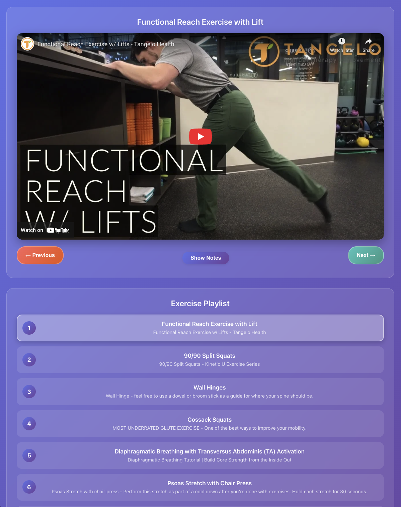

# Lower Back / Core PRT Plan



A modern, beautiful React + TypeScript app for managing and following your personalized Physical Rehabilitation Therapy (PRT) plan. Watch exercise videos, view detailed notes, and keep your recovery on track!

## Features
- Embedded YouTube videos for each exercise
- Playlist navigation with Previous/Next controls
- Expandable notes for each exercise
- Responsive, clean, and distraction-free UI
- Designed for lower back and core rehab, but easily extensible

## Getting Started
1. Install dependencies:
   ```sh
   npm install
   ```
2. Start the development server:
   ```sh
   npm start
   ```
3. Build for production (served from `/back/`):
   ```sh
   npm run build
   ```

## TODO / Ideas
- [ ] Track/log workouts and activity (dates, sets, reps, notes)
- [ ] Shuffle/randomize exercise order
- [ ] Add more exercises and stretches
- [ ] Group exercises into categories (e.g., Stretches, Strength, Mobility)
- [ ] General info/education section (e.g., warm-up, cool-down, safety)
- [ ] Log/View/Export workout logs

## General Info
- Built with [React](https://react.dev/) + [TypeScript](https://www.typescriptlang.org/)
- Styled for clarity and focus during rehab sessions
- Easily customizable for any rehab or fitness plan

---

*Created for personal use and as a template for others in physical therapy or fitness journeys.*
